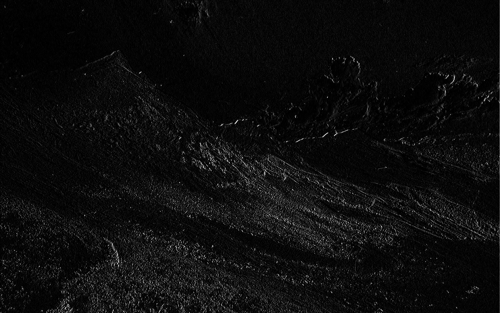
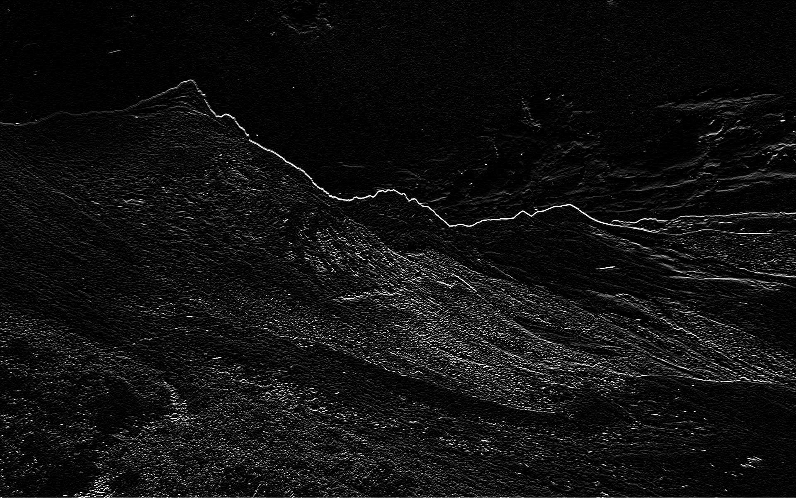
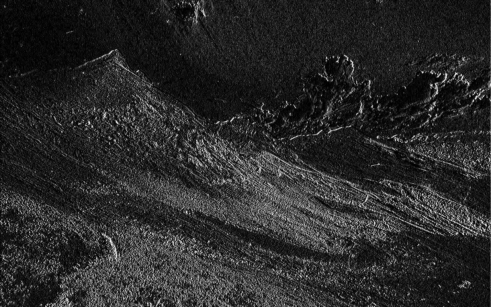
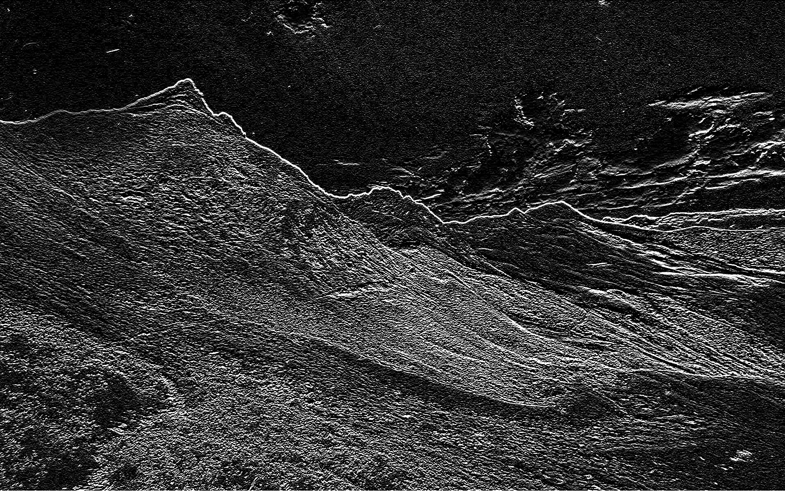
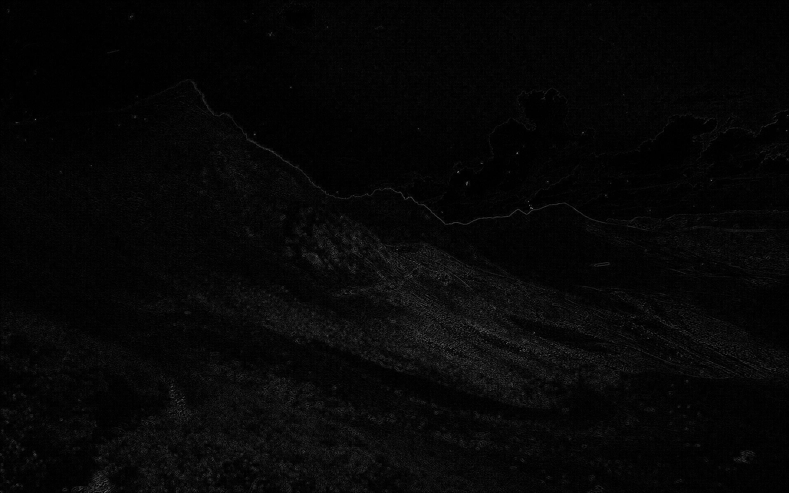

<h1 align="center">image-conv</h1>
<div align="center">

  

</div>
<div align="center">
  
  []()
  [](https://github.com/gp-97/image-conv/issues)
  [](https://github.com/gp-97/image-conv/pulls)
  

</div>

---

<p align="center">A high performance Rust library for image convolution.</p>

- [Documentation](https://docs.rs/image-conv/0.1.3/image_conv/index.html)
- [crate.io](https://crates.io/crates/image-conv)

### Example usage
- Apply horizontal Sobel filter:
```rust
  use image_conv::conv;
  use image_conv::Filter;
  use photon_rs::native::{open_image, save_image};

  fn main() {
      // Open an image
      let mut img = open_image("img.jpg").expect("No such file found");

      // Create a filter
      let sobel_x: Vec<f32> = vec![1.0, 0.0, -1.0, 2.0, 0.0, -2.0, 1.0, 0.0, -1.0];
      let filter = Filter::from(sobel_x, 3, 3);

      // Apply convolution    
      let img_conv = conv::convolution(&img, filter, 1, "uniform", 1);
      save_image(img_conv, "img_conv.jpg");
  }
```


### Some example ouputs
|Original|
|--------|
||

|Sobel-X|Sobel-Y|
|-------|-------|
|||

|Scharr-X|Scharr-Y|
|--------|--------|
||

|Laplacian|Median|
|-------|------|
|||

|Gaussian|Denoise|
|---------|-------|
|||  
