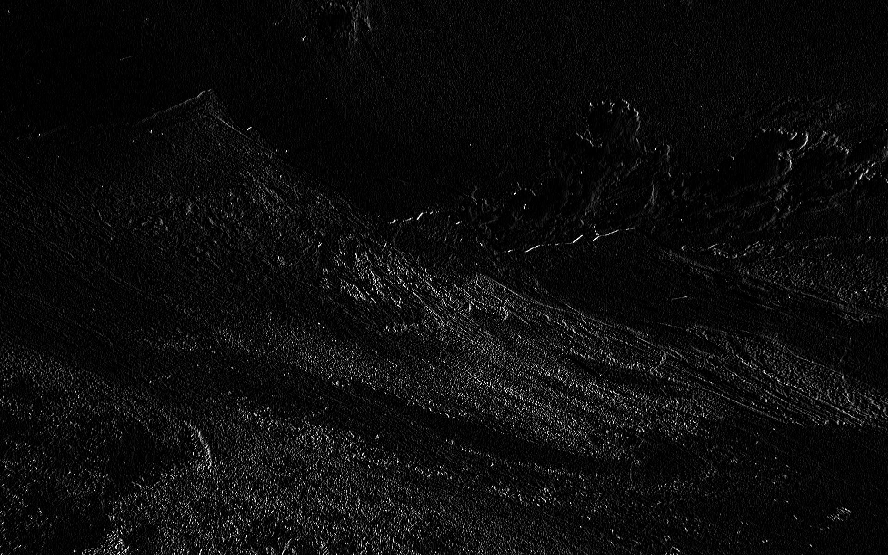
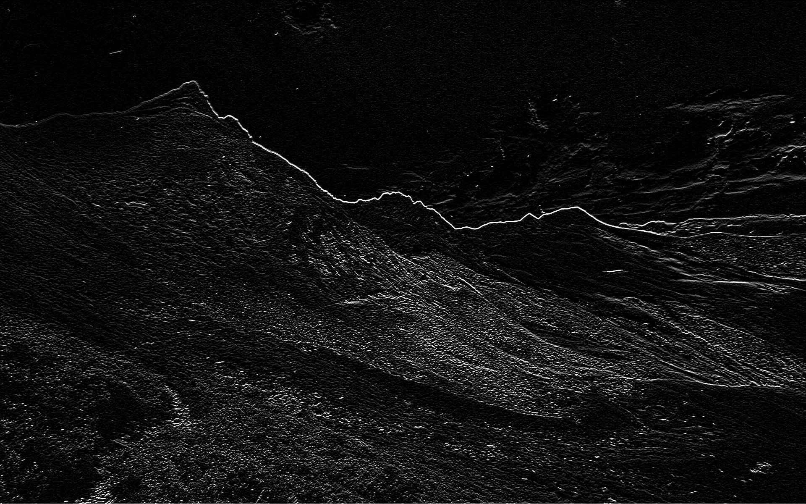
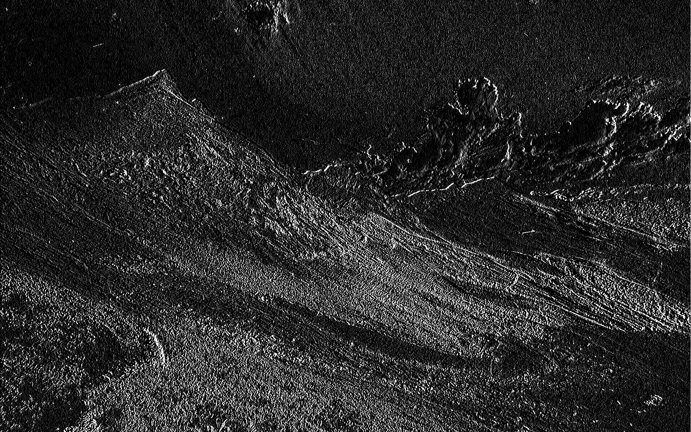
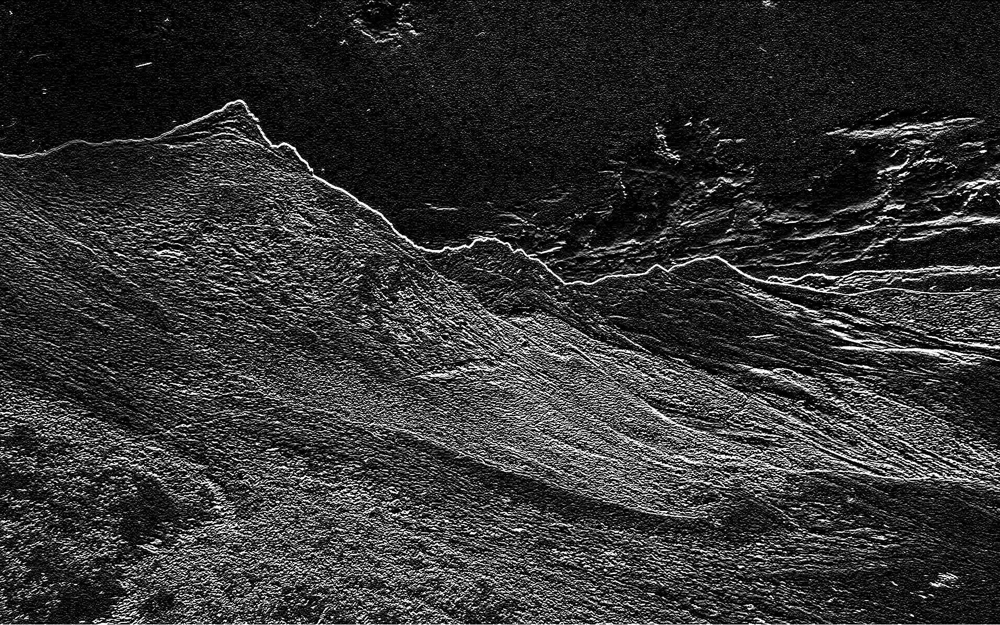
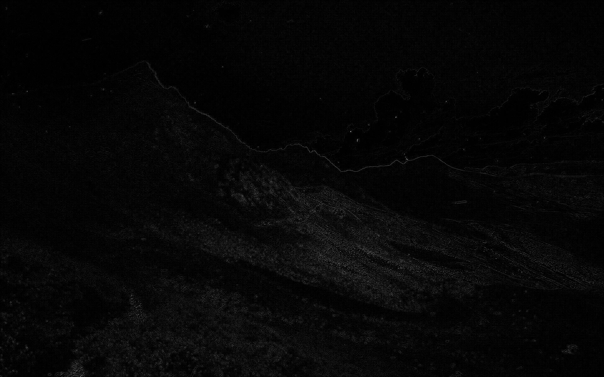

<h1 align="center">image-conv</h1>
<p align="center"><strong>High-performance image convolution library for Rust</strong></p>

<div align="center">

[](LICENSE)
[](https://github.com/gp-97/image-conv/actions/workflows/main.yml)
[](https://crates.io/crates/image-conv)
[](https://docs.rs/image-conv)

</div>

---

## What is it?

`image-conv` applies **convolution filters** to images — the mathematical operation behind edge detection, blurring, sharpening, and denoising. A small matrix (kernel) slides over every pixel, multiplying overlapping values and summing the results.

```text
  Input patch (3×3)      Kernel (Sobel-X)     Output pixel
  ┌────┬────┬────┐       ┌────┬────┬────┐
  │ a  │ b  │ c  │       │ +1 │  0 │ −1 │     out = a·1 + b·0 + c·(−1)
  ├────┼────┼────┤   ⊙   ├────┼────┼────┤         + d·2 + e·0 + f·(−2)
  │ d  │ e  │ f  │       │ +2 │  0 │ −2 │         + g·1 + h·0 + i·(−1)
  ├────┼────┼────┤       ├────┼────┼────┤
  │ g  │ h  │ i  │       │ +1 │  0 │ −1 │     → clamped to [0, 255]
  └────┴────┴────┘       └────┴────┴────┘
```

---

## Performance

Three optimisation tiers are applied **automatically** — no user configuration needed.

### Benchmark Results (4-core machine)

| Kernel | Size | Original | Current | Speedup |
|--------|------|----------|---------|---------|
| Sobel-X | 3×3 | 58.4 ms | 18.5 ms | **3.2×** |
| Laplacian | 3×3 | 58.2 ms | 26.6 ms | **2.2×** |
| Gaussian | 7×7 | 202.7 ms | 33.3 ms | **6.1×** |
| Gaussian | 9×9 | 320.7 ms | 33.9 ms | **9.5×** |
| Gaussian | 15×15 | 836.5 ms | 46.4 ms | **18.0×** |

Image size: 1000×1000, stride=1, no padding (worst-case). Lower is better.

### How the speedups work

| Tier | Technique | What it does | Typical gain |
|------|-----------|-------------|-------------|
| 1 | **Separable detection** | Decomposes Gaussian/Sobel kernels into two 1D passes: O(N²) → O(2N) ops per pixel | 3–9× |
| 2 | **Rayon threading** | Parallelises over output rows across all CPU cores | ~2–4× (scales with cores) |
| 3 | **Clean inner loops** | Branch-free iteration, direct memory access, pre-allocated buffers | ~10–20% |

The tiers compound — a 15×15 Gaussian gets 8.8× from separable + 2× from rayon = **~18× total**.

---

## Example outputs

| Original |
|----------|
|  |

| Sobel-X | Sobel-Y |
|---------|---------|
|  |  |

| Scharr-X | Scharr-Y |
|----------|----------|
|  |  |

| Laplacian | Median (3×3) |
|-----------|--------------|
|  |  |

| Gaussian (7×7) | Denoise (5×5) |
|----------------|---------------|
|  |  |

---

## Quick start

Add to your `Cargo.toml`:

```toml
[dependencies]
image-conv = "1.0"
photon-rs = "0.3"
```

```rust
use image_conv::conv;
use image_conv::{Filter, PaddingType};
use photon_rs::native::{open_image, save_image};

fn main() {
    // Open an image
    let img = open_image("input.jpg").expect("File not found");

    // Define a Sobel-X edge-detection kernel (3×3)
    let sobel_x: Vec<f32> = vec![
        1.0, 0.0, -1.0,
        2.0, 0.0, -2.0,
        1.0, 0.0, -1.0,
    ];
    let filter = Filter::from(sobel_x, 3, 3);

    // Apply convolution — auto-detects as separable for extra speed
    let result = conv::convolution(&img, filter, 1, PaddingType::UNIFORM(1));

    save_image(result, "output.jpg");
}
```

---

## API reference

### `Filter`

A 2D convolution kernel stored as a flat row-major `Vec<f32>`.

```rust
// Create from flat buffer (row 0, then row 1, ...)
let kernel = vec![1.0, 2.0, 1.0, 2.0, 4.0, 2.0, 1.0, 2.0, 1.0];
let filter = Filter::from(kernel, 3, 3);  // width=3, height=3

// Or create zero-initialised
let mut f = Filter::new(5, 5);
f.set_value_at_pos(1.0, (2, 2));

// Inspect
println!("{}", f.width());   // 5
println!("{}", f.height());  // 5
f.display();                 // pretty-print as table
```

### `PaddingType`

Controls border handling:

| Variant | Behaviour | Output size |
|---------|-----------|-------------|
| `UNIFORM(n)` | Pad `n` black pixels on all sides | `(in − filter + 2·n) / stride + 1` |
| `NONE` | No padding, output shrinks | `(in − filter) / stride + 1` |

```text
UNIFORM(1):              NONE:
┌···········┐           ┌─────────┐
┆ 0 0 0 0 0 ┆           │ * * * * │     filter 3×3
┆ 0 * * * 0 ┆           │ * * * * │     input 5×5 → output 3×3
┆ 0 * * * 0 ┆           │ * * * * │
┆ 0 * * * 0 ┆           └─────────┘
┆ 0 0 0 0 0 ┆
└···········┘
input 5×5 → output 5×5
```

### `conv::convolution()`

```rust
pub fn convolution(
    img: &PhotonImage,
    filter: Filter,
    stride: u32,         // 1 = dense, >1 = downsample
    padding: PaddingType,
) -> PhotonImage
```

- `stride = 0` terminates the process with an error.
- Stride values that don't evenly divide `(input − filter + 2·pad)` produce a warning.

---

## How it works

```text
convolution(img, filter, stride, padding)
│
├─ stride = 0?  →  ERROR
│
├─ try_separable()
│   ├─ Yes  →  separable_convolve()    2× 1D pass (O(fw+fh) per pixel)
│   │           ├─ Horizontal: 1D conv per row    (rayon-parallel)
│   │           └─ Vertical:   1D conv per column  (rayon-parallel)
│   │
│   └─ No   →  convolve()             1× 2D pass (O(fw·fh) per pixel)
│               └─ Standard 2D sliding window     (rayon-parallel)
│
└─ padding
    ├─ UNIFORM(n)  →  pad image with black border, then convolve
    └─ NONE        →  convolve directly (zero-copy, faster)
```

### Separable kernel decomposition

Many common kernels factor into an outer product of two 1D vectors:

```text
  [ 1  2  1 ]   [ 1 ]
  [ 2  4  2 ] = [ 2 ] × [ 1  2  1 ]
  [ 1  2  1 ]   [ 1 ]

  3×3 kernel    col    row
                3×1    1×3

Instead of 9 ops per pixel:  two 1D passes = 6 ops (1.5× faster)
Scale: 7×7 kernel: 49 ops → 14 ops (3.5× faster)
```

The library auto-detects separable kernels by finding the largest absolute value, extracting its row and column, and verifying the outer product matches every element within floating-point tolerance.

### Threading model

Each output row is **completely independent** — zero data dependencies between rows. Rayon splits the output buffer into per-row slices and processes them in parallel across all available CPU cores.

```text
  Output buffer (H rows × W cols × 4 bytes RGBA)
  ┌──────────────────────────────────────┐
  │ Row 0 ──▶ Thread 0                  │
  │ Row 1 ──▶ Thread 1                  │  All threads read
  │ Row 2 ──▶ Thread 2                  │  from the same input
  │   ...                               │  image (immutable).
  │ Row H−1 ──▶ Thread N                │  No locks, no contention.
  └──────────────────────────────────────┘
```

### Conversion helpers

```rust
// PhotonImage ↔ image::DynamicImage
let dyn_img: DynamicImage = image_conv::photon_to_dynamic(&photon_img);
let photon_img: PhotonImage = image_conv::dynamic_to_photon(&dyn_img);
```

---

## Project structure

```
src/
├── lib.rs       # Filter struct, PaddingType enum, separable detection,
│                #   DynamicImage ↔ PhotonImage conversion helpers
└── conv.rs      # Convolution engine: convolve(), separable_convolve(),
                 #   convolution() — with rayon + documentation
tests/
├── conv_test.rs        # Integration tests (all filter types + separable correctness)
└── filter_tests.rs     # Unit tests (Filter init, element assignment)
benches/
└── conv_bench.rs       # Criterion benchmarks (3×3 through 15×15, separable vs 2D)
```

---

## Running benchmarks

```bash
cargo bench
```

Results are stored in `target/criterion/`. Open `target/criterion/report/index.html` for interactive charts.

---

## Contributing

1. Open an issue describing your proposed change
2. Fork, develop, and test (`cargo test --release`)
3. Run `cargo fmt` before submitting
4. Submit a pull request

---

## License

Apache 2.0 — see [LICENSE](LICENSE).
